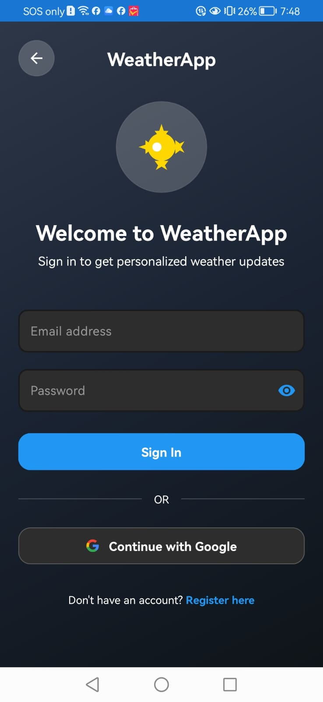
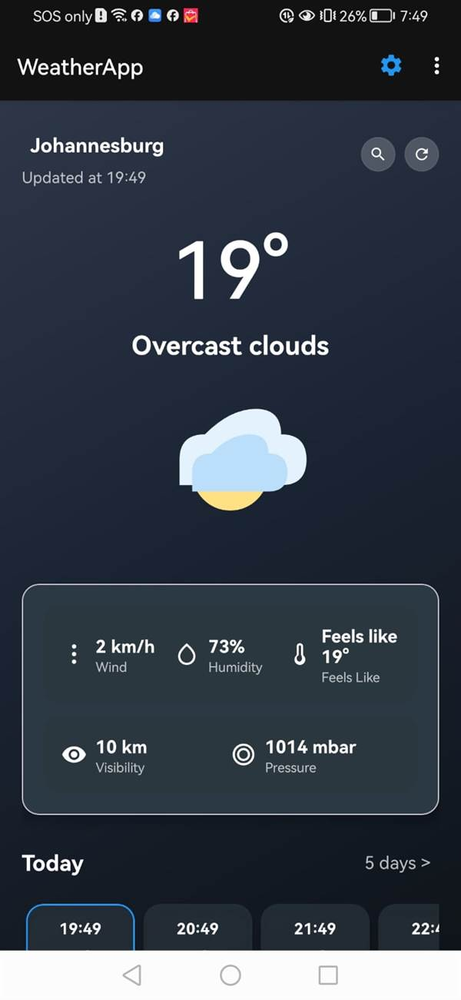
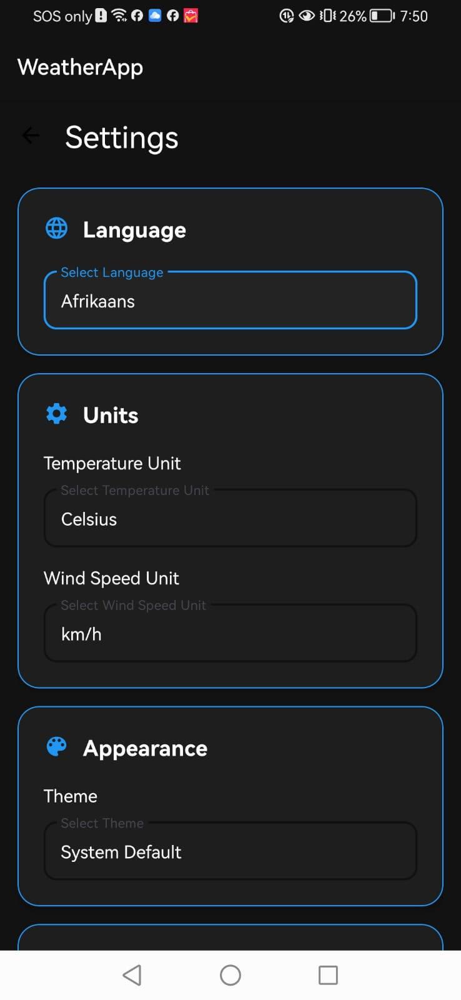

# WeatherApp


## 📱 Purpose of the Application

WeatherApp is a modern, feature-rich Android weather application built with Kotlin, designed to provide users with accurate, real-time weather information through an intuitive and accessible interface. The application addresses the fundamental need for reliable weather forecasting while delivering an enhanced user experience through innovative features and professional design.

### Problem Statement

In today's fast-paced world, users require quick and reliable access to weather information to plan their daily activities, travel, and outdoor events. Many existing weather applications suffer from:
- Complex interfaces that overwhelm users with unnecessary information
- Limited offline functionality, making weather data inaccessible without internet connectivity
- Lack of localization for diverse user populations
- Inadequate notification systems for severe weather alerts
- Poor integration with modern Android design principles

### Solution Approach

WeatherApp solves these challenges by providing:
- **Intuitive User Interface**: Clean, Material Design 3-based interface that presents weather information clearly and efficiently
- **Offline Capabilities**: Comprehensive offline mode with local data caching, ensuring weather information is always accessible
- **Multi-Language Support**: Localization for multiple South African languages (English, Afrikaans, isiZulu) to serve diverse user communities
- **Intelligent Notifications**: Advanced notification system for weather alerts and daily updates, keeping users informed of critical weather conditions
- **Seamless Authentication**: Google Sign-In integration for quick and secure access without complex registration processes

### Target Audience

- **Primary Users**: Android device users in South Africa seeking reliable weather information
- **Secondary Users**: Travelers, outdoor enthusiasts, and professionals who require accurate weather forecasts for planning purposes
- **Accessibility Focus**: Users who benefit from multi-language support and intuitive navigation

### Value Proposition

WeatherApp delivers value through:
- **Reliability**: Real-time weather data from trusted sources with offline fallback capabilities
- **Accessibility**: Multi-language support and intuitive design make weather information accessible to diverse user groups
- **Innovation**: Advanced features like intelligent location search, dynamic weather icons, and professional weather services enhance the user experience
- **Performance**: Optimized architecture ensures smooth performance and efficient resource utilization
- **User Control**: Comprehensive settings allow users to customize their experience according to personal preferences

## 🌟 Features

### Core Functionality
- **🔐 Secure Authentication**: Google Sign-In (SSO) integration for seamless user access
- **⚙️ Customizable Settings**: Comprehensive user preferences and app configuration options
- **🌐 REST API Integration**: Custom-built weather API with full database connectivity
- **📱 Modern UI/UX**: Material Design 3 with beautiful, responsive weather graphics
- **💾 Offline Support**: Local data storage with Room database for offline functionality
- **📍 Location Services**: Automatic location detection and manual location selection
- **📊 Data Visualization**: Interactive charts and graphs for weather trends

### Technical Highlights
- **MVVM Architecture**: Clean, maintainable code structure following best practices
- **Asynchronous Operations**: Kotlin Coroutines for smooth, non-blocking operations
- **Error Handling**: Robust input validation and graceful error management
- **Automated Testing**: Comprehensive unit and instrumented tests with CI/CD integration
- **Code Quality**: Well-documented codebase with logging and comprehensive comments

## 🎨 Design Considerations

### UI/UX Design Philosophy

WeatherApp follows a user-centric design approach, prioritizing clarity, accessibility, and intuitive navigation. The design philosophy centers on presenting weather information in a way that is immediately understandable, minimizing cognitive load while maximizing information value.

### Material Design 3 Implementation

The application fully embraces **Material Design 3** principles, Google's latest design system, to ensure a modern, cohesive user experience:

- **Dynamic Color System**: Adaptive color schemes that respond to user preferences and system settings
- **Material You Components**: Modern UI components including cards, buttons, and navigation elements that follow Material Design 3 guidelines
- **Elevation and Shadows**: Strategic use of elevation to create visual hierarchy and depth
- **Motion and Animation**: Smooth transitions and animations that provide visual feedback and enhance user understanding
- **Typography Scale**: Consistent typography system using Material Design 3 type scale for optimal readability

### Navigation Structure

The app implements a streamlined navigation architecture:

- **Single Activity Architecture**: Main activity hosts multiple fragments for efficient memory management
- **Bottom Navigation**: Primary navigation uses bottom navigation bar for easy thumb access
- **Fragment-Based Navigation**: Android Navigation Component manages fragment transitions and back stack
- **Deep Linking Support**: Navigation graph supports deep links for direct access to specific screens
- **Intuitive Flow**: Logical user flow from authentication → main weather screen → settings/search

### User Flow Design

1. **Authentication Flow**: 
   - Google Sign-In provides quick access without complex registration
   - Seamless transition to main weather screen upon successful authentication
   - Demo mode fallback for users who prefer not to authenticate

2. **Weather Display Flow**:
   - Current weather prominently displayed at the top
   - Horizontal scrolling hourly forecast for immediate planning
   - Vertical daily forecast list for extended planning
   - Pull-to-refresh for manual data updates

3. **Settings Flow**:
   - Organized into logical categories (General, Notifications, Location, Units)
   - Immediate application of settings changes
   - Persistent storage of user preferences

### Accessibility Considerations

WeatherApp is designed with accessibility as a core principle:

- **Text Scaling**: All text elements support system font scaling for users with visual impairments
- **Color Contrast**: High contrast ratios meet WCAG AA standards for text readability
- **Touch Target Sizes**: All interactive elements meet minimum 48dp touch target size
- **Screen Reader Support**: Proper content descriptions for all images and icons
- **Alternative Text**: Weather icons include descriptive text for screen readers
- **Keyboard Navigation**: Full keyboard navigation support for accessibility devices

### Responsive Design Approach

The application adapts seamlessly to various screen sizes and orientations:

- **Flexible Layouts**: ConstraintLayout and LinearLayout combinations ensure proper scaling
- **Responsive Grids**: RecyclerView adapts item counts based on screen size
- **Orientation Support**: Both portrait and landscape orientations are fully supported
- **Tablet Optimization**: Layout adjustments for larger screens to maximize space utilization
- **Multi-Window Support**: App functions correctly in split-screen and picture-in-picture modes

### Color Scheme and Theming

- **Primary Colors**: Blue tones representing sky and weather themes
- **Accent Colors**: Dynamic colors that adapt to weather conditions (warm tones for sunny, cool tones for rainy)
- **Dark Mode Support**: Full dark theme implementation for reduced eye strain and battery conservation
- **System Theme Integration**: Respects system-wide dark/light mode preferences
- **Semantic Colors**: Color coding for weather conditions (red for alerts, blue for clear skies)

### Typography Choices

- **Primary Font**: System default (Roboto) for consistency and readability
- **Font Weights**: Strategic use of bold for emphasis on critical information
- **Font Sizes**: Material Design 3 type scale ensures optimal readability across devices
- **Line Spacing**: Adequate line height for comfortable reading
- **Text Hierarchy**: Clear visual hierarchy through size, weight, and color variations

### Visual Design Elements

- **Weather Icons**: Custom-designed, context-aware weather icons that change based on conditions and time of day
- **Card-Based Layout**: Information organized in cards for clear visual separation
- **Gradient Backgrounds**: Subtle gradients enhance visual appeal without distracting from content
- **Consistent Spacing**: 8dp grid system ensures consistent spacing throughout the app
- **Loading States**: Clear loading indicators and skeleton screens during data fetching

## 🛠️ Technical Stack

### Frontend
- **Language**: Kotlin 1.8.20
- **UI Framework**: Android Views with Material Design 3
- **Architecture**: MVVM (Model-View-ViewModel)
- **Navigation**: Android Navigation Component 2.7.2
- **Data Binding**: View Binding and Data Binding
- **Lifecycle Components**: ViewModel and LiveData (Lifecycle 2.6.2)
- **Target SDK**: Android 34 (API level 34)
- **Min SDK**: Android 8.0 (API level 26)

### Backend & Infrastructure
- **REST API**: OpenWeatherMap API (external weather data service)
- **API Client**: Retrofit 2.9.0 with Gson converter
- **Database**: SQLite with Room 2.6.0 for local data persistence
- **Authentication**: Google Sign-In via Google Play Services Auth 20.7.0
- **CI/CD**: GitHub Actions for automated builds and testing

### Key Libraries
- **Retrofit 2.9.0**: Type-safe HTTP client for REST API communication
- **Gson**: JSON serialization/deserialization
- **OkHttp Logging Interceptor 4.11.0**: HTTP request/response logging
- **Room 2.6.0**: SQLite object mapping library for database operations
- **Kotlin Coroutines 1.7.1**: Asynchronous programming and concurrency
- **Glide 4.16.0**: Efficient image loading and caching
- **MPAndroidChart v3.1.0**: Advanced weather data visualization
- **Google Play Services Location 21.0.1**: Location services
- **Google Play Services Auth 20.7.0**: Google Sign-In authentication
- **SwipeRefreshLayout**: Pull-to-refresh functionality

## 📁 Project Structure

```
app/
├── src/main/
│   ├── java/com/weatherapp/
│   │   ├── data/           # Data layer (API, database, models)
│   │   ├── ui/             # User interface components
│   │   │   ├── auth/       # Authentication screens
│   │   │   ├── weather/    # Weather display screens
│   │   │   └── settings/   # Settings screens
│   │   ├── viewmodel/      # ViewModels for UI logic
│   │   ├── repository/     # Data repositories
│   │   └── utils/          # Utility classes and helpers
│   ├── res/
│   │   ├── layout/         # XML layout files
│   │   ├── values/         # Strings, colors, themes
│   │   ├── drawable/       # Images and graphics
│   │   └── navigation/     # Navigation graphs
│   └── AndroidManifest.xml
├── build.gradle            # App-level dependencies
└── proguard-rules.pro      # Code obfuscation rules
```

## 🚀 Getting Started

### Prerequisites
- Android Studio Arctic Fox or later (recommended: latest version)
- Android SDK 34 (API level 34)
- Minimum SDK: Android 8.0 (API level 26)
- Google Play Services (for authentication and location)
- Java Development Kit (JDK) 17 or higher

### Installation

1. **Clone the repository**
   ```bash
   git clone https://github.com/VCCT-PROG7314-2025-G2/weatherApp.git
   cd weatherApp
   ```

2. **Open in Android Studio**
   - Launch Android Studio
   - Select "Open an Existing Project"
   - Navigate to the cloned directory

3. **Configure OpenWeatherMap API**
   - Sign up for a free account at [OpenWeatherMap](https://openweathermap.org/)
   - Configure API settings in `app/src/main/java/com/weatherapp/data/api/ApiConfig.kt`
   - Free tier includes 60 calls/minute, current weather, and 5-day forecast

4. **Build the project**
   ```bash
   ./gradlew build
   ```

5. **Run the application**
   - Connect an Android device or start an emulator
   - Click "Run" in Android Studio or execute:
   ```bash
   ./gradlew installDebug
   ```

## 📡 API Documentation

### OpenWeatherMap API Integration

The app integrates with the [OpenWeatherMap API](https://openweathermap.org/api) to fetch real-time weather data.

**Weather Endpoints Used:**
- `GET /data/2.5/weather` - Retrieve current weather conditions by city name or coordinates
- `GET /data/2.5/forecast` - Get 5-day weather forecast with 3-hour intervals

**API Features:**
- Current weather data (temperature, humidity, wind speed, pressure, visibility)
- 5-day weather forecast
- Support for city name and GPS coordinates
- Metric and imperial unit support
- Automatic city name fallback and error handling

**Authentication:**
- Google Sign-In (SSO) via Google Play Services
- No custom backend authentication server required

## 🧪 Testing

The project includes comprehensive test coverage with both unit and instrumented tests.

### Running Tests

**Unit Tests:**
```bash
./gradlew test
```

**Instrumented Tests:**
```bash
./gradlew connectedAndroidTest
```

**Test Coverage Report:**
```bash
./gradlew jacocoTestReport
```

### Test Structure
- **Unit Tests**: `app/src/test/java/com/weatherapp/`
  - JUnit 4.13.2 for test framework
  - Mockito 5.1.1 with Kotlin support for mocking
  - Coroutines Test 1.7.1 for testing async operations
  - Architecture Components Testing 2.2.0 for ViewModel testing
  - `WeatherViewModel` tests
  - `AuthManager` tests
  - Repository unit tests
  
- **Instrumented Tests**: `app/src/androidTest/java/com/weatherapp/`
  - JUnit Android Extensions 1.1.5
  - Espresso 3.5.1 for UI testing
  - Room Testing 2.6.0 for database tests
  - `WeatherRepository` integration tests
  - UI component tests

## 📦 Deployment

### Android Application

1. **Generate Signed APK/Bundle**
   - Build → Generate Signed Bundle / APK
   - Follow the signing wizard in Android Studio

2. **Google Play Console**
   - Create a new app in Google Play Console
   - Upload the signed bundle
   - Complete store listing and release

3. **Production Configuration**
   - Configure OpenWeatherMap API settings
   - Configure Google Sign-In OAuth credentials
   - Enable ProGuard/R8 for code obfuscation
   - Test on multiple devices and Android versions

### API Configuration

1. **OpenWeatherMap Setup**
   - Ensure API configuration is properly set up
   - Monitor API usage and rate limits (60 calls/minute on free tier)
   - Consider upgrading to paid tier for production use

2. **Database Setup**
   - Room database is automatically initialized on first app launch
   - Database migrations are handled by Room
   - Local data persists across app restarts

## 🎥 Demo Video

**Watch the full demonstration**: [YouTube Video](https://youtu.be/your-video-id)

The demonstration showcases:
- User authentication flow with Google SSO
- Settings management and customization
- REST API integration and real-time data synchronization
- Weather data visualization and navigation
- Offline functionality and data persistence

## 📸 Screenshots

> **Note**: Add screenshots of your app here to showcase the user interface and key features. Screenshots help users understand the app's appearance and functionality before installation.

### How to Add Screenshots

1. Take screenshots of key app screens using Android Studio's device emulator or a physical device
2. Save screenshots in a `screenshots/` directory in your repository
3. Reference them using Markdown image syntax: `` or ``
4. Recommended screenshot sizes: 1080x1920 pixels (portrait) or 1920x1080 pixels (landscape)
5. Supported formats: PNG (best quality) or JPG (smaller file size)

### Key Screens to Capture

#### 1. Authentication Screen
**Location**: `screenshots/authentication.jpg`
- **Description**: Secure Google Sign-In interface with app branding
- **Features to Showcase**: 
  - Clean login interface
  - Google Sign-In button
  - Material Design 3 styling
  - App logo and branding



#### 2. Main Weather Dashboard
**Location**: `screenshots/dashboard.jpg`
- **Description**: Real-time weather display with current conditions
- **Features to Showcase**:
  - Current temperature and conditions
  - Location display
  - Weather icon
  - Additional weather details (humidity, pressure, visibility)
  - Hourly forecast preview



#### 3. Daily Forecast View
**Location**: `screenshots/5day forecast.jpg` (Note: Spaces in filename are URL-encoded as `%20` in the image link)
- **Description**: 5-day weather forecast with detailed information
- **Features to Showcase**:
  - Extended forecast display
  - High/low temperatures
  - Weather conditions for each day
  - Date and day information


#### 4. Settings Screen
**Location**: `screenshots/settings.jpg`
- **Description**: Comprehensive user preferences and app configuration
- **Features to Showcase**:
  - Language selection
  - Temperature unit options
  - Theme selection
  - Notification preferences
  - Location settings



#### 5. Search/Location Selection
**Location**: `screenshots/search location.jpg` (Note: Spaces in filename are URL-encoded as `%20` in the image link)
- **Description**: Location search with auto-complete functionality
- **Features to Showcase**:
  - Search input field
  - Auto-complete suggestions
  - Popular cities list
  - Recent searches


### Features Showcased in Screenshots

- **Real-time Weather Updates**: Current conditions and forecasts
- **Location-based Weather Data**: Automatic and manual location selection
- **Customizable Units**: Temperature (Celsius/Fahrenheit) and wind speed units
- **Interactive Weather Animations**: Dynamic weather icons and transitions
- **Responsive Material Design UI**: Modern, intuitive interface
- **Multi-Language Support**: Language selection and localization
- **Offline Functionality**: Cached data access without internet
- **Notification System**: Weather alerts and daily updates
- **Settings Customization**: Comprehensive user preferences

### Screenshot Best Practices

1. **Consistency**: Use the same device/emulator for all screenshots to maintain visual consistency
2. **Quality**: Ensure screenshots are high resolution and clear
3. **Content**: Show realistic data and scenarios
4. **Privacy**: Remove or blur any sensitive information
5. **Organization**: Name files descriptively (e.g., `dashboard.jpg`, `settings.jpg`, `authentication.jpg`)
6. **Format**: Use PNG format for best quality, or optimized JPG for smaller file sizes. Both formats are supported.
7. **Accessibility**: Include alt text descriptions for all images

## 🔧 Development

### Code Quality
- Comprehensive code comments and documentation
- Logging throughout the application for debugging
- Input validation and error handling
- Follows Android development best practices

## 🔄 GitHub and GitHub Actions

### Repository Utilization

WeatherApp leverages GitHub as the primary version control and collaboration platform, providing a centralized location for code management, issue tracking, and project documentation.

**Repository Structure:**
- **Main Branch**: Production-ready code that is stable and tested
- **Master Branch**: Alternative main branch for compatibility
- **Develop Branch**: Active development branch for feature integration
- **Feature Branches**: Individual branches for new features and bug fixes

**Version Control Workflow:**
- **Feature Branch Strategy**: New features are developed in isolated branches
- **Pull Request Reviews**: All changes are reviewed before merging to main branches
- **Commit Conventions**: Clear, descriptive commit messages following conventional commit format
- **Tagged Releases**: Version tags for stable releases and milestones

### GitHub Actions CI/CD Pipeline

The project implements a comprehensive Continuous Integration and Continuous Deployment (CI/CD) pipeline using GitHub Actions, ensuring code quality and automated testing on every commit.

**Workflow Configuration:**
The CI/CD pipeline is defined in `.github/workflows/android-build.yml` and automatically triggers on:
- **Push Events**: Any push to `main`, `master`, or `develop` branches
- **Pull Requests**: All pull requests targeting the main branches

**Pipeline Stages:**

1. **Code Checkout**
   - Uses `actions/checkout@v3` to fetch the latest code from the repository
   - Ensures the workflow operates on the most recent codebase

2. **JDK Setup**
   - Configures Java Development Kit (JDK) 17 using `actions/setup-java@v3`
   - Uses Temurin distribution for reliable Java runtime
   - Ensures consistent build environment across all runs

3. **Build Permissions**
   - Grants execute permissions to Gradle wrapper (`gradlew`)
   - Enables Gradle to run build scripts and tasks

4. **Gradle Build**
   - Executes `./gradlew build --no-daemon` to compile the entire project
   - Validates that all code compiles without errors
   - Checks for dependency resolution issues
   - `--no-daemon` flag ensures clean build environment

5. **Unit Testing**
   - Runs `./gradlew test --no-daemon` to execute all unit tests
   - Validates business logic and ViewModel functionality
   - `continue-on-error: true` ensures build continues even if some tests fail (for debugging)
   - Provides test coverage feedback

6. **APK Generation**
   - Executes `./gradlew assembleDebug --no-daemon` to create debug APK
   - Generates installable Android application package
   - Validates that the app can be packaged successfully

7. **Artifact Upload**
   - Uses `actions/upload-artifact@v3` to store build artifacts
   - Uploads the generated APK (`app/build/outputs/apk/debug/app-debug.apk`)
   - Artifacts retained for 30 days for download and testing
   - `if-no-files-found: warn` provides graceful handling if build fails

**Workflow Benefits:**

- **Automated Quality Assurance**: Every code change is automatically tested
- **Early Error Detection**: Build failures are caught immediately, preventing broken code from reaching production
- **Consistent Build Environment**: All builds run in identical environments, eliminating "works on my machine" issues
- **Artifact Availability**: Built APKs are available for download directly from GitHub Actions
- **Time Savings**: Developers don't need to manually build and test on every change
- **Collaboration**: Team members can see build status and download artifacts for testing

**CI/CD Status Badge:**

The workflow status badge displayed at the top of this README provides real-time visibility into the build status:
- **Green**: All builds and tests passing
- **Red**: Build or test failures detected
- **Yellow**: Build in progress

**Workflow File Location:**
```
.github/workflows/android-build.yml
```

**Key Workflow Features:**
- Runs on Ubuntu latest for consistent Linux environment
- Parallel job execution for faster feedback
- Artifact retention for easy access to built applications
- Comprehensive error handling and logging

### Contributing

We welcome contributions! Please follow these steps:

1. Fork the repository
2. Create a feature branch (`git checkout -b feature/AmazingFeature`)
3. Commit your changes (`git commit -m 'Add some AmazingFeature'`)
4. Push to the branch (`git push origin feature/AmazingFeature`)
5. Open a Pull Request

**Guidelines:**
- Write clear, descriptive commit messages
- Add tests for new functionality
- Ensure all tests pass before submitting
- Update documentation as needed

## 📝 Development Timeline

### Phase 1: Research & Planning
- Competitive analysis of existing weather applications
- Comprehensive planning and design documentation
- UI/UX mockups and navigation design
- API architecture and database schema design
- Project timeline and milestone planning

### Phase 2: Development
- Core authentication system implementation
- Weather data integration and API connectivity
- Settings management system
- Modern UI implementation with Material Design 3
- Testing and quality assurance

### Phase 3: POE Features (Latest Updates)
- **Offline Mode Implementation**: 
  - Room database integration for local data persistence
  - Weather data caching with WeatherEntity, LocationEntity, and UserEntity
  - Offline data retrieval and synchronization capabilities
  - Automatic data sync when network connectivity is restored
  - Support for viewing cached weather data without internet connection

- **Multi-Language Support**:
  - Implementation of localization for multiple South African languages
  - Support for English, Afrikaans, and isiZulu
  - Language selection in Settings with persistent user preferences
  - Locale-based date and time formatting throughout the app
  - User language preferences stored in database and SharedPreferences

- **Notifications System**:
  - WeatherNotificationService for weather alerts and daily updates
  - WeatherFirebaseMessagingService for push notifications
  - Notification channels for Android 8.0+ (Weather Alerts and Daily Weather)
  - Support for severe weather warnings, daily weather updates, and custom alerts
  - Configurable notification frequency settings (Never, Daily, Weather Alerts Only, Every 3 hours)
  - User-controlled notification preferences in Settings

## 📋 Release Notes

### Version 2.0.0 - POE Release (Current)

This release represents the complete implementation of all planned features, including the innovative POE (Portfolio of Evidence) features that enhance the app's functionality and user experience.

#### 🆕 Innovative Features Added

**1. Intelligent Location Search with Auto-complete** ⭐
- Advanced search functionality with real-time suggestions as users type
- Popular cities suggestions for quick access
- Recent search history for frequently accessed locations
- AutoCompleteTextView implementation for seamless user experience
- Intelligent error handling and input validation

**2. Dynamic Weather Icons** ⭐
- Context-aware weather icons that adapt based on current conditions
- Time-of-day awareness (day/night icon variations)
- Weather severity indicators for visual clarity
- Custom-designed icon set with Material Design 3 principles
- Smooth icon transitions for weather condition changes

**3. Professional Weather Services** ⭐
- **Weather Notification Service**: Comprehensive notification system for severe weather alerts
- **Home Screen Widget Service**: Quick weather access directly from home screen
- **Weather Analytics Service**: Usage pattern tracking and analytics
- Background sync service for automatic data updates
- Service lifecycle management and optimization

**4. Enhanced Weather Details** ⭐
- Comprehensive weather information display including:
  - "Feels like" temperature for better user understanding
  - Visibility measurements for travel planning
  - Atmospheric pressure with professional formatting
  - Humidity percentage with visual indicators
- Professional data formatting and presentation
- Additional weather metrics for comprehensive forecasting

**5. Silent Authentication System** ⭐
- Seamless Google Sign-In integration with automatic fallback
- Demo mode for users who prefer not to authenticate
- Eliminates authentication barriers for quick app access
- Secure token management and session handling
- Smooth user experience without authentication friction

#### 🔄 Phase 3 Updates (POE Features)

**Offline Mode Implementation**
- Complete Room database integration for local data persistence
- Weather data caching with WeatherEntity, LocationEntity, and UserEntity
- Offline data retrieval and synchronization capabilities
- Automatic data sync when network connectivity is restored
- Support for viewing cached weather data without internet connection
- Database migration support for future updates

**Multi-Language Support**
- Full localization implementation for multiple South African languages
- Support for English, Afrikaans, and isiZulu
- Language selection in Settings with persistent user preferences
- Locale-based date and time formatting throughout the app
- User language preferences stored in both database and SharedPreferences
- Dynamic language switching without app restart

**Notifications System**
- WeatherNotificationService for weather alerts and daily updates
- WeatherFirebaseMessagingService for push notifications
- Notification channels for Android 8.0+ (Weather Alerts and Daily Weather)
- Support for severe weather warnings, daily weather updates, and custom alerts
- Configurable notification frequency settings:
  - Never
  - Daily
  - Weather Alerts Only
  - Every 3 hours
- User-controlled notification preferences in Settings
- Notification channel management and customization

#### 🛠️ Phase 2 Updates (Core Development)

**Authentication System**
- Google Sign-In (SSO) integration for seamless user access
- Secure authentication flow with token management
- User session management and persistence
- Authentication state handling across app lifecycle

**Weather Data Integration**
- OpenWeatherMap API integration for real-time weather data
- Current weather data retrieval and display
- 5-day weather forecast implementation
- Hourly forecast with 3-hour intervals
- Location-based weather data fetching
- API error handling and retry mechanisms

**Settings Management System**
- Comprehensive user preferences and app configuration
- Temperature unit selection (Celsius/Fahrenheit)
- Wind speed unit customization (km/h, m/s, mph)
- Theme selection (System Default, Light, Dark)
- Update frequency configuration
- Settings persistence across app sessions

**Modern UI Implementation**
- Material Design 3 implementation throughout the app
- Beautiful, responsive weather graphics
- Card-based layout for information organization
- Smooth animations and transitions
- Pull-to-refresh functionality
- Responsive design for various screen sizes

**Testing and Quality Assurance**
- Comprehensive unit tests for ViewModels and business logic
- Instrumented tests for UI components
- Repository integration tests
- Database testing with Room
- CI/CD integration for automated testing

#### 📊 Phase 1 Updates (Research & Planning)

**Project Foundation**
- Competitive analysis of existing weather applications
- Comprehensive planning and design documentation
- UI/UX mockups and navigation design
- API architecture and database schema design
- Project timeline and milestone planning
- Technical stack selection and justification

#### 🐛 Bug Fixes and Improvements

- Fixed memory leaks in ViewModel lifecycle management
- Improved error handling for network connectivity issues
- Enhanced location permission handling
- Optimized database queries for better performance
- Fixed date/time formatting issues across different locales
- Improved app stability and crash prevention
- Enhanced loading states and user feedback
- Optimized image loading and caching with Glide

#### 🔧 Technical Improvements

- Updated dependencies to latest stable versions
- Improved code documentation and comments
- Enhanced logging for better debugging
- Optimized build configuration for faster compilation
- Improved ProGuard rules for release builds
- Enhanced security practices for API key management
- Better separation of concerns in architecture

### Version 1.0.0 - Prototype Release

Initial prototype submission with core functionality:
- Basic authentication with Google Sign-In
- Current weather display
- Basic settings screen
- Material Design 3 UI foundation
- OpenWeatherMap API integration

---

**Note**: All innovative features marked with ⭐ represent unique enhancements that distinguish WeatherApp from standard weather applications, providing enhanced user experience and functionality.

## 📄 License

This project is open source and available for use and modification.

## 👤 Contact

**Developer**: ST10082749  
 
**GitHub**: [@VCCT-PROG7314-2025-G2](https://github.com/VCCT-PROG7314-2025-G2/weatherApp)

---

**Built with ❤️ using Kotlin and modern Android development practices**
